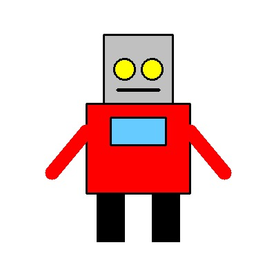
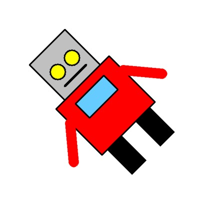
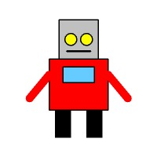
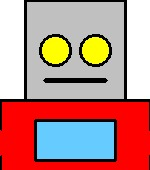
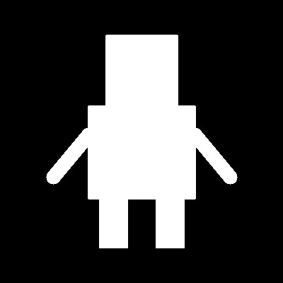
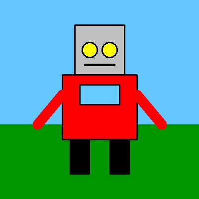

# UTS-Computer-Vision
🦾 OpenCV Character Transformation and Bitwise Operations

Proyek ini menampilkan cara membuat dan memanipulasi karakter robot sederhana menggunakan OpenCV dan NumPy.
Program secara otomatis membuat gambar karakter, menerapkan berbagai transformasi (translasi, rotasi, resize, crop), serta operasi bitwise untuk menggabungkan karakter dengan latar belakang.

📂 Struktur Proyek
├── karakter_transformasi.py     # Script utama
├── img/                         # Folder hasil background
├── output/                      # Folder hasil gambar transformasi
└── README.md                    # Dokumentasi proyek

⚙ Fitur Utama
Pembuatan Karakter Robot
Menggambar kepala, badan, tangan, dan kaki menggunakan bentuk dasar (rectangle, circle, line).
Warna-warna disimpan dalam format BGR.
Transformasi Gambar
Translasi: Memindahkan posisi karakter.
Rotasi: Memutar karakter sebesar 45°.
Resize: Mengubah ukuran menjadi setengah dimensi asli.
Crop: Memotong bagian tengah karakter.
Operasi Bitwise
Membuat background dengan warna dan objek tambahan.
Menghasilkan mask untuk mengisolasi karakter.
Menggabungkan karakter dengan background baru menggunakan operasi bitwise_and dan add.
🧩 Library yang Digunakan
OpenCV (cv2)
NumPy
os (built-in Python)
🚀 Cara Menjalankan Program
Pastikan Python sudah terinstal.
Cek dengan:
python --version
Instal dependensi:
pip install opencv-python numpy
Jalankan program:
python karakter_transformasi.py
Setelah dijalankan, hasil gambar akan tersimpan di folder:
output/ → hasil transformasi & operasi bitwise
img/ → hasil background
📸 Hasil Keluaran
Jenis Gambar	Lokasi File	Deskripsi
karakter.png	output/	Gambar robot asli
translasi.png	output/	Hasil translasi
rotate.png	output/	Hasil rotasi 45°
resize.png	output/	Hasil resize 50%
crop.png	output/	Potongan bagian tengah
bitwise.png	output/	Mask biner dari karakter
final.png	output/	Gabungan karakter dan background
background.jpg	img/	Background dasar
🧠 Penjelasan Konsep

Transformasi Geometris:
Mengubah posisi, ukuran, dan orientasi gambar menggunakan matriks affine.

Operasi Bitwise:
Teknik penggabungan dua gambar berdasarkan mask biner (hitam-putih), umum digunakan untuk efek overlay dan compositing.
Hasil

